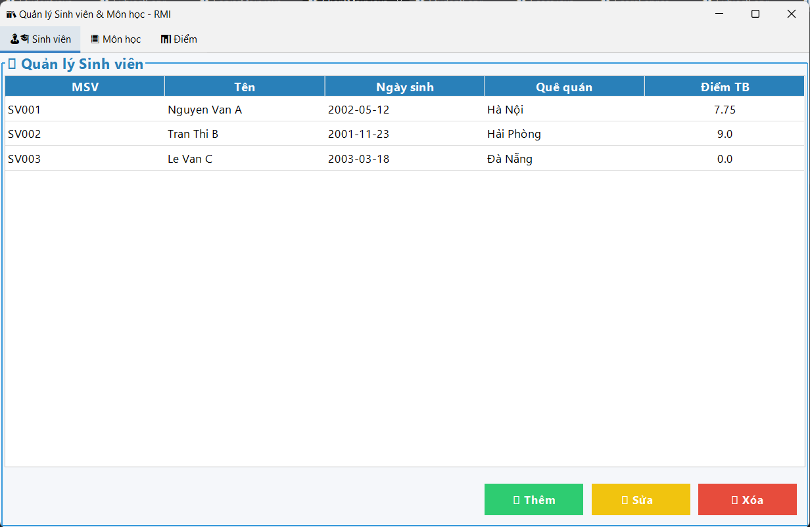
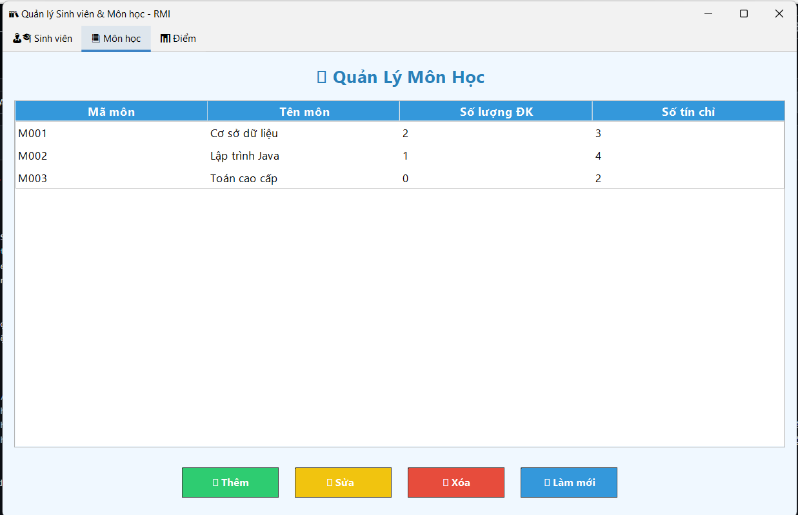
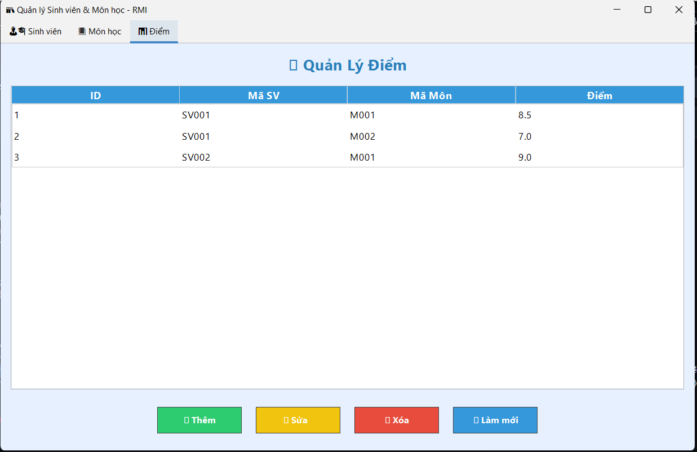
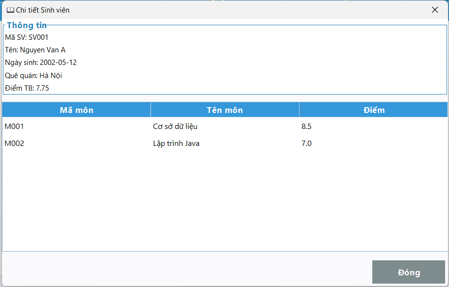

<h2 align="center">
    <a href="https://dainam.edu.vn/vi/khoa-cong-nghe-thong-tin">
    🎓 Faculty of Information Technology (DaiNam University)
    </a>
</h2>
<h2 align="center">
   QUẢN LÝ SINH VIÊN BẰNG RMI
</h2>
<div align="center">
    <p align="center">
        
        
        
    </p>

[](https://www.facebook.com/DNUAIoTLab)
[](https://dainam.edu.vn/vi/khoa-cong-nghe-thong-tin)
[](https://dainam.edu.vn)

</div>


## 📖 1. Giới thiệu hệ thống
Ứng dụng được xây dựng theo mô hình Client - Server sử dụng Java RMI để quản lý dữ liệu sinh viên, môn học và điểm số.
Dữ liệu được lưu trữ trong SQLite database, giao diện người dùng sử dụng Java Swing với thiết kế hiện đại, trực quan.

Các chức năng chính:
1. Quản lý Sinh viên: Thêm, sửa, xóa, xem chi tiết sinh viên.
2. Quản lý Môn học: Thêm, sửa, xóa môn học, hiển thị số lượng sinh viên đăng ký.
3. Quản lý Điểm số: Nhập điểm, sửa điểm, xóa điểm, tính điểm trung bình tự động.
4. Hiển thị chi tiết: Double-click để xem chi tiết sinh viên cùng bảng điểm và thông tin môn học.
5. Xử lý lỗi & thông báo: Thông báo rõ ràng khi nhập sai định dạng, lỗi kết nối hoặc thao tác thất bại.
6. Giao diện GUI: Thiết kế bằng Swing, hỗ trợ màu sắc, nút chức năng, bảng dữ liệu trực quan.
## 🔧 2. Công nghệ sử dụng
###🖥️ Java RMI (Remote Method Invocation)

Được dùng để triển khai mô hình Client-Server.
Server cung cấp dịch vụ quản lý Sinh viên, Môn học, Điểm số.
Client gọi các phương thức từ xa (remote methods) mà không cần quan tâm đến chi tiết triển khai.

###🗄️ SQLite Database

CSDL nhẹ, nhúng, dễ triển khai.
Các bảng chính:
- Student: Lưu thông tin sinh viên (MSV, họ tên, ngày sinh, lớp, khoa).
- Subject: Lưu thông tin môn học (mã môn, tên môn, số tín chỉ, số lượng đăng ký).
- Score: Lưu điểm số của sinh viên cho từng môn học.

###🎨 Java Swing

Xây dựng giao diện người dùng (GUI).
Các thành phần:
- JFrame, JPanel: Tổ chức giao diện chính.
- JTable: Hiển thị dữ liệu dạng bảng (sinh viên, môn học, điểm).
- JButton, JTextField, JComboBox: Xử lý thao tác nhập liệu.
- JOptionPane: Hiển thị thông báo hoặc xác nhận.

### 📂 Mô hình đa lớp

Model: Các lớp POJO như Student, Subject, Score.
Service: Khai báo interface (remote) và triển khai logic (server-side).
Client: Xây dựng giao diện, gọi service từ xa qua RMI.
Database Util: Lớp DBUtil dùng Singleton để quản lý kết nối SQLite.

#### Hỗ trợ:
-flataf-3.6.1.jar: Thư viện hỗ trợ làm swing nhìn mượt hơn
-sqlite-jdbc-3.50.3.0.jar: Thư viện hỗ trợ làm việc với CSDL SQLite

## 🚀 3. Hình ảnh các chức năng

<p align="center">  </p> <p align="center"> <em>Hình 1: Giao diện quản lý Sinh viên – hiển thị danh sách sinh viên, thêm, sửa, xóa, xem chi tiết.</em> </p> <p align="center">  </p> <p align="center"> <em>Hình 2: Giao diện quản lý Môn học – hiển thị danh sách môn học, thêm mới và chỉnh sửa thông tin môn học.</em> </p> <p align="center">  </p> <p align="center"> <em>Hình 3: Giao diện quản lý Điểm số – nhập điểm cho sinh viên theo môn học, hiển thị điểm trung bình.</em> </p> <p align="center">  </p> <p align="center"> <em>Hình 4: Hộp thoại chi tiết Sinh viên – hiển thị thông tin cá nhân và toàn bộ điểm số của sinh viên đó.</em> </p>


## 📝 4. Hướng dẫn cài đặt và sử dụng

###🔧 Yêu cầu hệ thống

- Java Development Kit (JDK): Phiên bản 8 trở lên
- Hệ điều hành: Windows, macOS, hoặc Linux
- Môi trường phát triển: IDE (IntelliJ IDEA, Eclipse, VS Code) hoặc terminal/command prompt
- Bộ nhớ: Tối thiểu 512MB RAM
-  Dung lượng: Khoảng 20MB cho mã nguồn và file thực thi

### 📦 Cài đặt và triển khai

#### Bước 1: Chuẩn bị môi trường
1. **Kiểm tra Java**: Mở terminal/command prompt và chạy:
   ```bash
   java -version
   javac -version
   ```
   Đảm bảo cả hai lệnh đều hiển thị phiên bản Java 8 trở lên.

2. **Tải mã nguồn**:
   ```bash
   git clone https://github.com/RobiRobin555/LTM_quan_ly_sinh_vien_RMI.git
   ``` 

#### Bước 2: Biên dịch mã nguồn
1. Mở terminal và điều hướng đến thư mục chứa src
2. **Biên dịch toàn bộ project:**:
   ```bash
   javac src/**/*.java
   ```
   Hoặc biên dịch từng file cụ thể (ví dụ StudentPanel.java):
   ```bash
   javac src/client/panel/StudentPanel.java
   ```

3. **Kiểm tra kết quả**: Nếu biên dịch thành công, sẽ tạo ra các file `.class` tương ứng.

#### Bước 3: Chạy ứng dụng

**Khởi động Server:**
Dùng IDLE Eclipse trong project explorer , tìm đến src -> server-> khởi chạy ServerMain.java
- Server sẽ khởi động trên các địa chỉ được đăng ký


**Khởi động Client:**
Dùng IDLE Eclipse trong project explorer , tìm đến src -> client-> khởi chạy ClientMain.java
- Khi chạy thành công thì 1 panel sẽ hiện ra thông tin của các học sinh như hình trên.
- Người dùng sẽ có các thao tác CRUD với các học sinh.
- khi double-click vào msv hoặc tên của 1 sinh viên thì 1 dialog hiển thị thông tin của sinh viên đó sẽ hiện ra.

### 🚀 Sử dụng ứng dụng

#### 1. Khởi động ứng dụng

Chạy file Main.java, giao diện chính sẽ hiển thị.
Mặc định có 3 panel chính:
- 📚 Quản lý Sinh viên
- 📘 Quản lý Môn học
- 📝 Quản lý Điểm số
  
#### 2. Quản lý Sinh viên

- Thêm mới sinh viên bằng cách nhấn ➕ Thêm → nhập thông tin và lưu.
- Sửa thông tin sinh viên bằng cách chọn 1 dòng → nhấn ✏️ Sửa.
- Xóa sinh viên bằng cách chọn dòng → nhấn 🗑 Xóa.
- Nhấn double-click vào sinh viên để xem chi tiết cùng bảng điểm.

#### 3. Quản lý Môn học

- Thêm, sửa, xóa môn học với các nút chức năng tương ứng.
- Xem danh sách tất cả môn học trong bảng.

#### 4. Quản lý Điểm số

- Gán điểm cho sinh viên theo từng môn.
- Cập nhật hoặc xóa điểm khi cần.
- Bảng hiển thị đầy đủ Mã SV, Tên SV, Môn học, Điểm.

#### 5. Giao diện người dùng

- Ứng dụng sử dụng Java Swing với giao diện thân thiện, có màu sắc và bố cục rõ ràng.
- Bảng dữ liệu hỗ trợ sắp xếp, chọn dòng, và hiển thị trực quan.
## 5. Liên Hệ
- Họ tên: Vũ Giang Nam
- Lớp : CNTT16-03
- Email: giangnamvn555@gmail.com
- SDT:0369864785

---------------------------------------------------------------------------------------------------------------------------------------------------------------------------------------------------------------------------------------------
© 2025 AIoTLab, Faculty of Information Technology, DaiNam University. All rights reserved.

---
